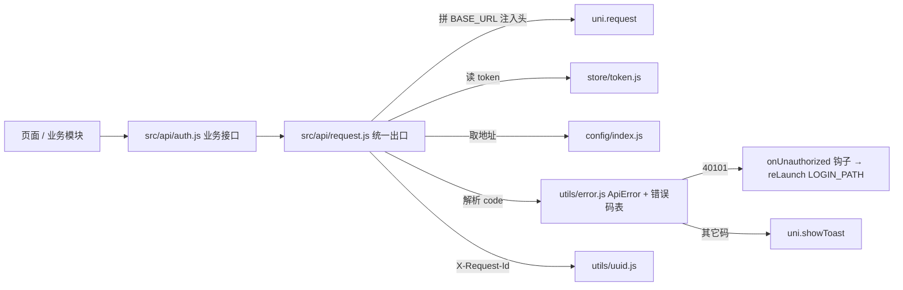

## 用户需求

规划 `medbox-spec/08_特性分支清单_小程序.md` 中 **`feat/mp-request`**（地基第 2 项）分支的实现。

清单原文要求：

- 内容：`uni.request` 封装 —— 自动拼 `BASE_URL`、注入 `Authorization: Bearer` 与 `X-Request-Id`；统一解析 `code/message/data`；错误码提示（40101 跳登录、40301/40302 提示）；loading 与异常兜底
- 验收：任意接口调用走同一封装；40101 自动跳登录页
- 依赖 `mp-scaffold`（已完成），参考 02 的 1.1 / 1.2

## 产品概述

家用智能药品箱小程序端的**网络请求地基**。所有 REST 调用统一走一个封装出口：自动补后端地址与鉴权头、自动生成幂等请求号、按统一响应结构拆包、按错误码做差异化处理（登录态失效跳登录、越权与监护未生效给出明确提示）、统一 loading 与网络异常兜底。业务页面只关心「拿到 data」或「拿到可读错误」，不再各自处理 HTTP 细节。

## 核心功能

1. **统一请求出口**：`request(options)` + `get/post/put/del` 便捷方法，返回 Promise；成功直接兑现业务 `data`，失败拒绝为携带 `code/message/traceId/httpStatus` 的错误对象
2. **自动拼地址与鉴权**：相对路径自动拼 `BASE_URL`；默认注入 `Authorization: Bearer {token}`，登录/注册等接口可关闭鉴权
3. **幂等请求号**：写操作（POST/PUT/PATCH/DELETE）自动生成 32 位十六进制 `X-Request-Id`，与后端链路追踪同一字段
4. **统一响应解析**：按 02 的 1.1 拆 `code/message/data`；`data` 字段缺失按 `null` 处理（不把缺失当异常）
5. **错误码分流**：40101 清 token 并跳登录入口、40301 越权提示、40302 提示监护关系未生效、40401/40901/42901/50310/50000 各有文案，未知码按服务端错误兜底；网络失败与超时给出局域网排查提示
6. **loading 与提示**：可开启的加载遮罩（并发计数，不重复弹）、可关闭的自动 toast，异常兜底不静默失败
7. **可扩展钩子**：未登录处理逻辑可注入覆盖，登录页由 `feat/mp-auth` 落地，本分支只约定页面路径常量
8. **首个业务消费者**：交付认证相关接口模块（登录 / 注册 / 刷新 / 当前用户），供后续登录分支直接复用

## 技术栈

- **端**：`medbox-miniapp/`（uni-app 官方 CLI 工程，Vue 3.4 + Vite 5.2.8），本分支**只改这一个端目录**（仓库根 `AGENTS.md` 铁律）
- **网络**：`uni.request`（uni-app 跨端 API，微信小程序运行时可用），不引入 axios（小程序环境不可用、且会增包）
- **存储**：`uni.getStorageSync / setStorageSync` 同步读写 token（`src/config/index.js` 已用同一风格读 `serverHost`，保持一致）
- **语言**：ES Module + JSDoc 注释（现有 `config/index.js` 即为该风格，不引入 TS）
- **对齐后端**：`medbox-server` 的 `R<T>`（`code/message/data/traceId/timestamp`）、`ErrorCode`（封闭集合）、`TraceContext`（`X-Request-Id` → `X-Trace-Id`）

## 实现方案

### 总体策略

在 `src/utils/` 建原子能力（错误码表、错误类型、请求号生成、token 存储），在 `src/api/` 建统一出口 `request.js` 与首个业务模块 `auth.js`。分层保持单向依赖：`api/request.js → utils/* + store/token.js + config/index.js`，业务模块只依赖 `api/request.js`，页面不直接碰 `uni.request`。

### 关键技术决策

| 决策 | 选择 | 理由 |
| --- | --- | --- |
| 返回值 | 成功 resolve `data`，失败 reject `ApiError` | 业务层不用写 `res.data.data`；错误对象带 `code` 便于细分处理（如 40901 设备离线） |
| 鉴权 | 默认注入，选项 `auth: false` 关闭 | 登录 / 注册 / 刷新本身无 token，显式关闭比"token 为空就不带"更安全可控 |
| loading | **默认关闭**，传 `true` 或标题字符串才显示；内部并发计数，计数归零才 `hideLoading` | 静默请求（轮询、WS 补充拉取）不该弹遮罩；并发计数避免多个请求互相提前关掉遮罩 |
| 自动 toast | 默认开启（`silent: true` 关闭） | 与清单"错误码提示"一致；列表页自绘空态 / 表单自定义校验时可关掉避免重复提示 |
| `X-Request-Id` | 仅写操作自动生成，32 位十六进制（无连字符） | 对齐后端 `TraceContext.sanitize`（只接受 `[A-Za-z0-9_-]`、长度 ≤ 64），让客户端 traceId 与后端日志可 grep 贯通；GET 无幂等诉求不生成，减少无意义差异 |
| 40101 处理 | 默认「清 token → `uni.reLaunch` 到 `LOGIN_PATH`」，同时暴露 `setUnauthorizedHandler()` 注入钩子 | 满足验收；登录页属 `feat/mp-auth`，钩子让后续分支接入 refresh 重试时**不必改本文件**（开闭原则） |
| token 存储位置 | `src/store/token.js`（最小可用：读写 + 清除 + key 常量） | README 已把 `store/` 标给 mp-auth，本文件是它的**起点**，mp-auth 在此扩展 refresh 与用户信息，不新建平行模块 |
| 未知错误码 | 按 50000 兜底 | 与后端 `ErrorCode.of(int)` 行为一致，不透出未知码 |
| 网络异常 | 统一文案「网络异常，请检查手机与电脑是否在同一局域网」 | 局域网演示阶段最高频失败原因就是网段 / IP 不对，文案要能自解释 |


### 性能与可靠性

- 单次请求开销：`uni.request` 调用 + 一次同步读缓存取 token（`getStorageSync` 微秒级），无循环、无额外拷贝
- loading 计数为模块级整数变量，`showLoading` 只在 0→1、`hideLoading` 只在 1→0 时调用，避免高频请求抖动
- 失败路径不做重试（重试与 refresh 归 `feat/mp-auth` 的钩子），避免"并发刷新风暴"与重复写操作
- 超时默认 10s；`uni.request` 的 fail 回调（DNS 失败 / 断网 / 超时）与业务错误码走同一出口，调用方只需一个 `catch`
- 日志：`console.warn` 输出 `code + traceId + path`，便于用 traceId 到后端日志 grep；**不打印请求体**（含密码、身份证等敏感字段）

## 实现要点（执行细节）

- `data` 缺失必须按 `null` 处理：后端全局 `non_null` 会省略 null 字段，判断异常只能用 `code !== 0`（CHANGELOG V1.12 明确要求）
- 响应结构校验：响应体不是对象、或没有数字型 `code` 字段（如 `/medbox/actuator/**` 的 Spring 原生格式、HTML 错误页）→ 一律按 50000 兜底，不要让调用方拿到 undefined
- 登录页路径常量 `LOGIN_PATH = '/pages/auth/login'` 与 `feat/mp-auth` 对齐，需在 08 文档中写死这条约定；`reLaunch` 前先 `uni.removeTabBarBadge` 之类的清理不做（超出本分支）
- 不挂载到 `main.js` 全局（`Vue.prototype` / `app.config.globalProperties`）：保持 ES Module 显式 import，与现有工程风格一致，也便于后续 mock
- 不在本分支改 `pages.json` / `App.vue` / `pages/index/index.vue`（登录页、路由守卫属 mp-auth），避免同文件冲突
- 严格按 02 的 1.2 错误码表建映射，不新增错误码；新增必须同步改文档与后端枚举

## 架构设计

调用链：页面 / 业务模块 → `api/auth.js`（业务封装）→ `api/request.js`（统一出口）→ `uni.request`



错误码分流（02 的 1.2）：`40101` → 清 token + 钩子跳登录；`40102` → 提示账号或密码错误（登录页自行处理，可 `silent`）；`40301` → 无权限；`40302` → 监护关系未生效，请等待老人确认；`40401` → 资源不存在；`40901` → 状态冲突；`42901` → 请求过于频繁；`50310` → AI 服务暂不可用；`50000` 与未知码 → 服务端内部错误（附 traceId）。

## 目录结构

```
medbox-miniapp/
├── src/
│   ├── api/
│   │   ├── request.js        # [NEW] 统一请求出口：拼 BASE_URL、注入 Authorization / X-Request-Id、
│   │   │                     #       解析 code/message/data、错误码分流、loading 与网络兜底；
│   │   │                     #       导出 request/get/post/put/del、setUnauthorizedHandler、LOGIN_PATH
│   │   └── auth.js           # [NEW] 首个业务消费者（02 第 3 章）：login / register / refresh / getMe，
│   │   │                     #       供 feat/mp-auth 直接复用；登录注册传 auth:false
│   │   ├── store/
│   │   │   └── token.js      # [NEW] 最小 token 存储：ACCESS_TOKEN / REFRESH_TOKEN key 常量、
│   │   │                     #       getAccessToken / setTokens / clearTokens；feat/mp-auth 在此扩展
│   │   └── utils/
│   │       ├── error.js      # [NEW] 错误码常量表（对齐 02 的 1.2）+ ApiError 类（code/message/traceId/httpStatus）
│   │       └── uuid.js       # [NEW] 32 位十六进制请求号生成（小程序无 crypto.randomUUID）
│   └── README.md             # [MODIFY] 新增「请求封装用法」小节：导入方式、选项、错误处理示例
medbox-spec/
├── 08_特性分支清单_小程序.md  # [MODIFY] feat/mp-request 勾选为 [x]，补注 LOGIN_PATH 与 store/token.js 归属约定
├── 02_REST接口设计.md         # [MODIFY] 1.1 补《小程序落地约定》：X-Request-Id 生成规则与注入范围
├── CHANGELOG.md              # [MODIFY] 新增 [V1.13] 条目与《影响提示》
├── 00_README_文档索引.md      # [MODIFY] 头部版本号同步 V1.13
├── 03_设备接入协议_MQTT.md     # [MODIFY] 头部版本号同步 V1.13
├── 04_实时推送协议_WebSocket.md # [MODIFY] 头部版本号同步 V1.13
├── 05_AI大模型与RAG方案.md     # [MODIFY] 头部版本号同步 V1.13
└── 06_数据库设计.md           # [MODIFY] 头部版本号同步 V1.13
```

## 关键代码结构

```js
// src/api/request.js —— 统一出口（仅签名，不含实现）
/**
 * @typedef {Object} RequestOptions
 * @property {string} url          相对路径，如 '/users/me'；已是 http(s) 开头则不拼 BASE_URL
 * @property {string} [method]     默认 GET
 * @property {Object|string} [data]
 * @property {Object} [params]     query 参数，自动拼到 url
 * @property {boolean} [auth=true] 是否注入 Authorization: Bearer
 * @property {boolean|string} [loading=false] true/'加载中' 显示遮罩
 * @property {boolean} [silent=false] true 时不做自动 toast
 * @property {number} [timeout=10000]
 * @returns {Promise<any>} 成功兑现 data；失败拒绝 ApiError
 */
export function request(options) {}
export const get = (url, params, options) => request({ ...options, url, params, method: 'GET' })
export const post = (url, data, options) => request({ ...options, url, data, method: 'POST' })
export const put = (url, data, options) => request({ ...options, url, data, method: 'PUT' })
export const del = (url, data, options) => request({ ...options, url, data, method: 'DELETE' })
/** 注入未登录处理（feat/mp-auth 接入 refresh 时用）；返回上一个 handler */
export function setUnauthorizedHandler(fn) {}
export const LOGIN_PATH = '/pages/auth/login'
```

```js
// src/utils/error.js —— 错误类型（业务层按 code 细分）
export const CODE = { SUCCESS: 0, BAD_REQUEST: 40001, UNAUTHORIZED: 40101, BAD_CREDENTIALS: 40102,
  FORBIDDEN: 40301, GUARDIAN_PENDING: 40302, NOT_FOUND: 40401, CONFLICT: 40901,
  TOO_MANY_REQUESTS: 42901, INTERNAL_ERROR: 50000, AI_UNAVAILABLE: 50310 }

export class ApiError extends Error {
  constructor({ code, message, traceId, httpStatus, url }) { super(message) }
}
```

## Agent Extensions

### SubAgent

- **code-explorer**
- 用途：实现前复核 `medbox-miniapp/src` 下现有文件（`config/index.js`、`package.json`、README）与后端 `ErrorCode` / `R` / `TraceContext` 的最新字段口径，确保封装与文档一致
- 预期结果：确认无遗漏的既有约定（如 storage key、错误码集合），避免凭记忆写错字段名